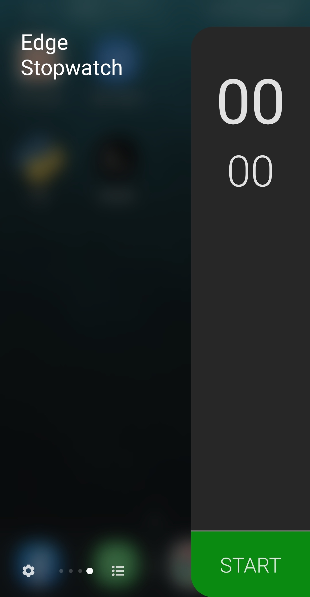
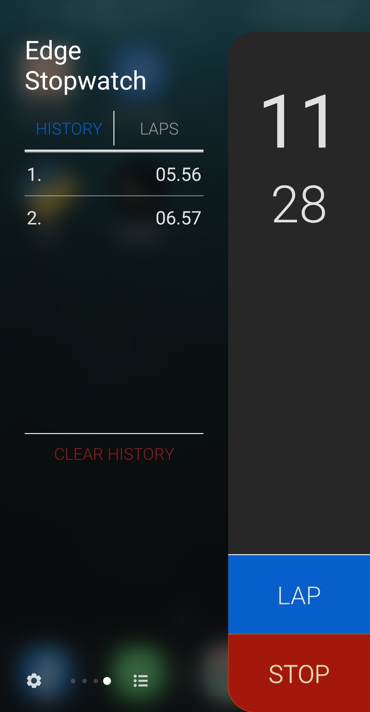
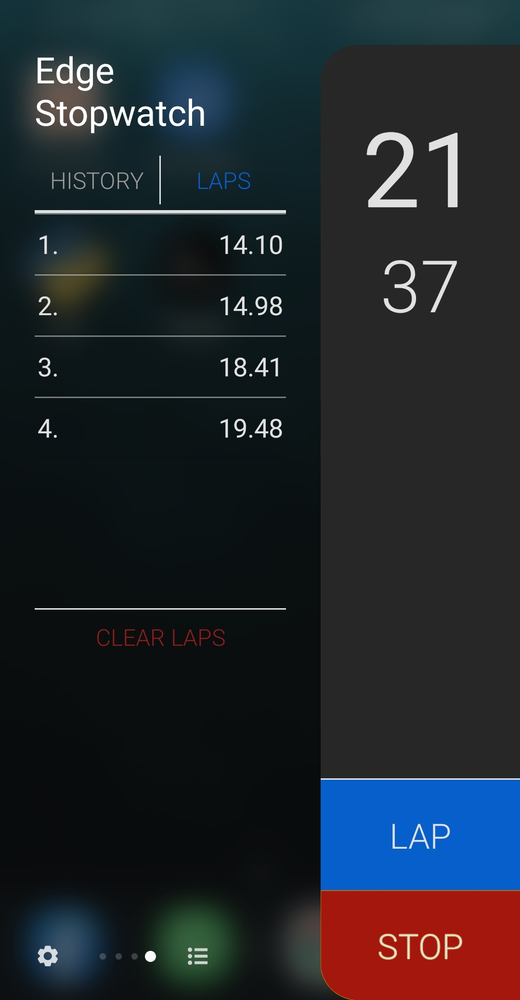

# Stopwatch Edge

Stopwatch (chronometer) for Samsung devices supporting the Edge Panel feature (S7, S8, ...).
* Classical features: START/PAUSE/RESUME/STOP/RESET buttons
* LAP button, which saves partial times
* Times history
* Customizable theme (light/dark)
* Customizable precision (from seconds up to centiseconds)
* Customizable display font

## Installation

Download the latest version of `edge-stopwatch.apk` from the *Releases* section and install it.

## What it looks like

    
    
    

